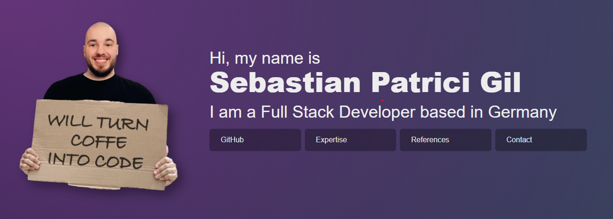

# 🚀 Sebastian Patrici Gil | Portfolio

## ✨ Über dieses Projekt

Eine moderne, interaktive Portfolio-Website, die mit Next.js und Tailwind CSS entwickelt wurde. Die Seite präsentiert meine Fähigkeiten, Expertise und Projekte in einem eleganten, reaktionsschnellen Design.

## 🛠️ Technologien

- **Framework**: [Next.js](https://nextjs.org/)
- **Styling**: [Tailwind CSS](https://tailwindcss.com/)
- **Animationen**: Custom Scroll & Mouse Animations
- **Deployment**: [Vercel](https://vercel.com)

## 🔥 Features

- Responsive Design für alle Geräte
- Interaktive Maus-Effekte und Glow-Elemente
- Smooth Scroll mit Snap-Punkten
- Dynamische Komponenten mit React
- Performanceoptimierte Animationen
